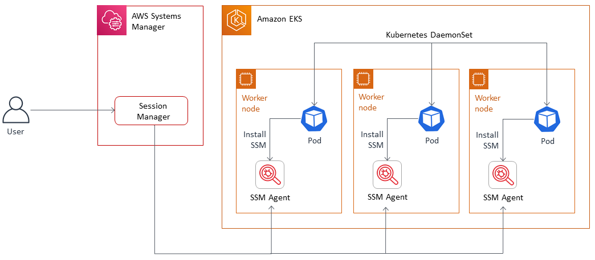

<!-- BEGINNING OF PRE-COMMIT-TERRAFORM DOCS HOOK -->
## Requirements

| Name | Version |
|------|---------|
| terraform | >= 0.13.5 |
| aws | >= 3.19 |

## Providers

| Name | Version |
|------|---------|
| aws | >= 3.19 |
| random | n/a |

## Inputs

| Name | Description | Type | Default | Required |
|------|-------------|------|---------|:--------:|
| cluster\_name | The name of the EKS cluster, will be lookup-ed | `string` | n/a | yes |
| subnet\_ids | A list of subnet IDs to launch resources in | `list(string)` | n/a | yes |
| ami\_release\_version | AMI version of the EKS Node Group. Defaults to latest version for Kubernetes version | `string` | `null` | no |
| ami\_type | (optional) Type of Amazon Machine Image (AMI) associated with the EKS Node Group. Valid values: `AL2_x86_64`, `AL2_x86_64_GPU`. | `string` | `null` | no |
| capacity\_type | Type of capacity associated with the EKS Node Group. Defaults to ON\_DEMAND. Valid values: ON\_DEMAND, SPOT. | `string` | `"SPOT"` | no |
| create\_iam\_role | Create IAM role for node group. Set to true if you for some reason need to create node\_role\_arn with this module. Not recommended. | `bool` | `false` | no |
| desired\_size | Desired number of worker nodes | `number` | `1` | no |
| disk\_size | Disk size in GiB for worker nodes. Defaults to 20. Terraform will only perform drift detection if a configuration value is provided | `number` | `null` | no |
| ec2\_ssh\_key | (not recommended - consider ssm) SSH key name that should be used to access the worker nodes | `string` | `null` | no |
| force\_update\_version | (optional) Force version update if existing pods are unable to be drained due to a pod disruption budget issue. | `bool` | `false` | no |
| instance\_types | List of instance types associated with the EKS Node Group. Consider passing list for spot groups | `list(string)` | `null` | no |
| kubernetes\_labels | Key-value mapping of Kubernetes labels. Only labels that are applied with the EKS API are managed by this argument. Other Kubernetes labels applied to the EKS Node Group will not be managed | `map(string)` | `{}` | no |
| launch\_template | (optional) Configuration block with Launch Template settings. `name`, `id` and `version` parameters are available. | `map(string)` | `{}` | no |
| max\_size | Maximum number of worker nodes | `number` | `3` | no |
| min\_size | Minimum number of worker nodes | `number` | `1` | no |
| node\_group\_name | The name of the cluster node group. Defaults to <cluster\_name>-<random value> | `string` | `""` | no |
| node\_group\_role\_name | (optional) The name of the cluster node group role. Defaults to <cluster\_name>-managed-group-node | `string` | `""` | no |
| node\_role\_arn | IAM role arn that will be used by managed node group, consider passing externally created | `string` | `""` | no |
| source\_security\_group\_ids | Set of EC2 Security Group IDs to allow SSH access (port 22) from on the worker nodes. If you specify `ec2_ssh_key`, but do not specify this configuration when you create an EKS Node Group, port 22 on the worker nodes is opened to the Internet (0.0.0.0/0) | `list(string)` | `[]` | no |
| tags | A map of tags (key-value) passed to resources. | `map(string)` | `{}` | no |

## Outputs

| Name | Description |
|------|-------------|
| iam\_role\_arn | IAM role ARN used by node group. |
| iam\_role\_id | IAM role ID used by node group. |
| node\_group | Outputs from EKS node group. See `aws_eks_node_group` Terraform documentation for values |

<!-- END OF PRE-COMMIT-TERRAFORM DOCS HOOK -->

Import
EKS Node Groups can be imported using the cluster_name and node_group_name separated by a colon (:), e.g.
```
$ terraform import aws_eks_node_group.my_node_group my_cluster:my_node_group
```

## Theory

Managed node groups are always deployed with an Amazon EC2 Auto Scaling Group launch template.
If you don't specify your own launch template to use when creating a managed node group,
the Amazon EKS API creates a launch template with default values in your account.
Creating your own launch template and a managed node group from that template has the benefit of providing
you with a greater level of flexibility and customization when deploying managed nodes than is provided by the
default launch template. For the highest level of customization, you can deploy managed nodes using your own
launch template and a custom AMI.

After you've deployed a managed node group with your own launch template, you can then update it with a
different version of the same launch template. When you update your node group to a different version of
your launch template, all of the nodes in the group are recycled to match the new configuration of the
specified launch template version. Existing node groups that do not use a custom launch template can't be
updated directly. Rather, you must create a new node group with a custom launch template to do so.

### Launch template configuration basics
You can create an Amazon EC2 Auto Scaling launch template with the AWS Management Console, AWS CLI, or an AWS SDK.
For more information, see Creating a Launch Template for an Auto Scaling Group in the Amazon EC2 User Guide.
Some of the settings in a launch template are similar to the settings used for managed node configuration.
When deploying or updating a node group with a launch template, some settings must be specified in the node group configuration
or the launch template, but not both. If a setting exists where it shouldn't, then operations such as creating
or updating a node group fail.

The following table lists the settings that are prohibited in a launch template and which similar settings (if any) are required in the managed node group configuration. The listed settings are the settings that appear in the console.
They might have similar but different names in the AWS CLI and SDK.

| Launch template – Prohibited  | Amazon EKS node group configuration  |   |
|---|---|---|
|  IAM instance profile under Advanced details | Node IAM Role under Node Group configuration on the Configure Node Group page  |   |
| Subnet under Network interfaces (Add network interface)  |  Subnets under Node Group network configuration on the Specify networking page |   |
| Shutdown behavior and Stop - Hibernate behavior under Advanced details. Retain default Don't include in launch template setting in launch template for both settings.  | No equivalent. Amazon EKS must control the instance lifecycle, not the Auto Scaling group.  |   |


The following table lists the settings that are prohibited in a managed node group configuration and which similar settings (if any) are required in a launch template. The listed settings are the settings that appear in the console. They might have similar names in the AWS CLI and SDK.

| Amazon EKS node group configuration – Prohibited  | Launch template  |   |
|---|---|---|
|  (Only if you specified a custom AMI in a launch template) AMI type under Node Group compute configuration on Set compute and scaling configuration page – Console displays Specified in launch template and the AMI ID that was specified. If an AMI type was not specified in the launch template, then you can select an AMI in the node group configuration. | AMI under Launch template contents – You must specify if you're using a custom AMI. If you specify an AMI that doesn't meet the requirements listed in Using a custom AMI, the node group deployment will fail.  |   |
| Disk size under Node Group compute configuration on Set compute and scaling configuration page – Console displays Specified in launch template.  | Size under Storage (Volumes) (Add new volume). You must specify this in the launch template.  |   |
| SSH key pair under Node Group configuration on the Specify Networking page – The console displays the key that was specified in the launch template or displays Not specified in launch template.  | Key pair name under Key pair (login).  |   |
| You can't specify source security groups that are allowed remote access when using a launch template.  |  Security groups under Network settings for the instance or Security groups under Network interfaces (Add network interface), but not both. For more information, see Using custom security groups. |   |

https://docs.aws.amazon.com/eks/latest/userguide/launch-templates.html#launch-template-security-groups

### Tagging Amazon EC2 instances
You can use the TagSpecification parameter of a launch template to specify which tags to apply to Amazon EC2 instances in your node group. The IAM entity calling the CreateNodegroup or UpdateNodegroupVersion APIs must have permissions for ec2:RunInstances and ec2:CreateTags, and the tags must be added to the launch template.

Using custom security groups
You can use a launch template to specify custom Amazon EC2 security groups to apply to instances in your node group. This can be either in the instance level security groups parameter or as part of the network interface configuration parameters. However, you can't create a launch template that specifies both instance level and network interface security groups. Consider the following conditions that apply to using custom security groups with managed node groups:

Amazon EKS only allows launch templates with a single network interface specification.

By default, Amazon EKS applies the cluster security group to the instances in your node group to facilitate communication between nodes and the control plane. If you specify custom security groups in the launch template using either option mentioned earlier, Amazon EKS doesn't add the cluster security group. Therefore, you must ensure that the inbound and outbound rules of your security groups enable communication with your cluster’s endpoint. Incorrect security group rules result in worker nodes being unable to join the cluster. To learn about the security group rules that you should need to apply, see Amazon EKS security group considerations.

If you need SSH access to the instances in your node group, be sure to include a security group that allows that access.

### Amazon EC2 user data
You can supply Amazon EC2 user data in your launch template using cloud-init when launching your instances. For more information, see the cloud-init documentation. Your user data can be used to perform common configuration operations.

### Using a custom AMI
If your organization needs to run a custom AMI due to specific security, compliance, or internal policy requirements, you can deploy such AMIs to managed node groups by using a launch template. For more information, see Amazon Machine Images (AMI) in the Amazon EC2 User Guide for Linux Instances. The Amazon EKS AMI build specification contains resources and configuration scripts for building a custom Amazon EKS AMI based on Amazon Linux 2. For more information, see Amazon EKS AMI Build Specification on GitHub. To build custom AMIs installed with other operating systems, see Amazon EKS Sample Custom AMIs on GitHub.

Note
When using a custom AMI, Amazon EKS doesn't merge any user data. Rather, you're responsible for supplying the required bootstrap commands for nodes to join the cluster. If your nodes fail to join the cluster, the Amazon EKS CreateNodegroup and UpdateNodegroupVersion actions also fail.

To use a custom AMI with managed node groups, specify an AMI ID in the imageId field of the launch template. To update your node group to a newer version of a custom AMI, create a new version of the launch template with an updated AMI ID, and update the node group with the new launch template version.

Limitations of using custom AMIs with managed node groups

You must create a new node group to switch between using custom AMIs and Amazon EKS optimized AMIs.

The following fields can't be set in the API if you're using a custom AMI

- amiType
- releaseVersion
- version

The custom AMI can't be Windows because Windows can't be used in managed node groups.

### Spots on launch templates

If you deploy a node group using a launch template, then you can specify zero or one Instance type under Launch
template contents in a launch template or you can specify 0-20 instance types for Instance types on the Set
compute and scaling configuration page in the console, or using other tools that use the Amazon EKS API.
If you specify an instance type in a launch template, and use that launch template to deploy your node group,
then you can't specify any instance types in the console or using other tools that use the Amazon EKS API.
If you don't specify an instance type in a launch template, in the console, or using other tools that use
the Amazon EKS API, then the t3.medium instance type is used, by default. If your node group is using the
Spot capacity type, then we recommend specifying multiple instance types using the console. For more information,
see Managed node group capacity types.

If any containers that you deploy to the node group use the Instance Metadata Service Version 2, then make sure
to set the Metadata response hop limit to 2 in your launch template. For more information, see Instance metadata
and user data in the Amazon EC2 User Guide. If you deploy a managed node group without using a custom launch
template, this value is automatically set for the node group in the default launch template.


### Alternative ways to connect to node instances: SSM

https://docs.aws.amazon.com/prescriptive-guidance/latest/patterns/install-ssm-agent-on-amazon-eks-worker-nodes-by-using-kubernetes-daemonset.html



Prerequisites

Container instances should have the required permissions to communicate with the SSM service.
The AWS Identity and Access Management (IAM) managed role `AmazonSSMManagedInstanceCore` provides the required permissions for SSM Agent to run on Amazon Elastic Compute Cloud (Amazon EC2) instances.

```sh
    aws iam attach-role-policy --role-name staging20201020121930440900000009  --policy-arn arn:aws:iam::aws:policy/AmazonSSMManagedInstanceCore
```

Limitations

This pattern applies only to Linux-based worker nodes.
The DaemonSet pods run in privileged mode. If the Amazon EKS cluster has a webhook that
blocks pods in privileged mode, the SSM Agent will not be installed.

```yml
apiVersion: extensions/v1beta1
kind: DaemonSet
metadata:
  labels:
    k8s-app: ssm-installer
  name: ssm-installer
  namespace: default
spec:
  selector:
    matchLabels:
      k8s-app: ssm-installer
  template:
    metadata:
      labels:
        k8s-app: ssm-installer
    spec:
      containers:
      - image: amazonlinux
        imagePullPolicy: Always
        name: ssm
        command: ["/bin/bash","-c","echo '* * * * * root rpm -e amazon-ssm-agent-2.3.1550.0-1.x86_64 && yum install -y https://s3.amazonaws.com/ec2-downloads-windows/SSMAgent/latest/linux_amd64/amazon-ssm-agent.rpm && systemctl restart amazon-ssm-agent && rm -rf /etc/cron.d/ssmstart' > /etc/cron.d/ssmstart && echo 'Successfully installed SSM agent'"]
        securityContext:
          allowPrivilegeEscalation: true
        volumeMounts:
        - mountPath: /etc/cron.d
          name: cronfile
        terminationMessagePath: /dev/termination-log
        terminationMessagePolicy: File
      volumes:
      - name: cronfile
        hostPath:
          path: /etc/cron.d
          type: Directory
      dnsPolicy: ClusterFirst
      restartPolicy: Always
      schedulerName: default-scheduler
      terminationGracePeriodSeconds: 30
```

```sh
AWS_DEFAULT_REGION=us-west-2 aws ssm start-session --target i-04ffadbaae98a5bd0
```
